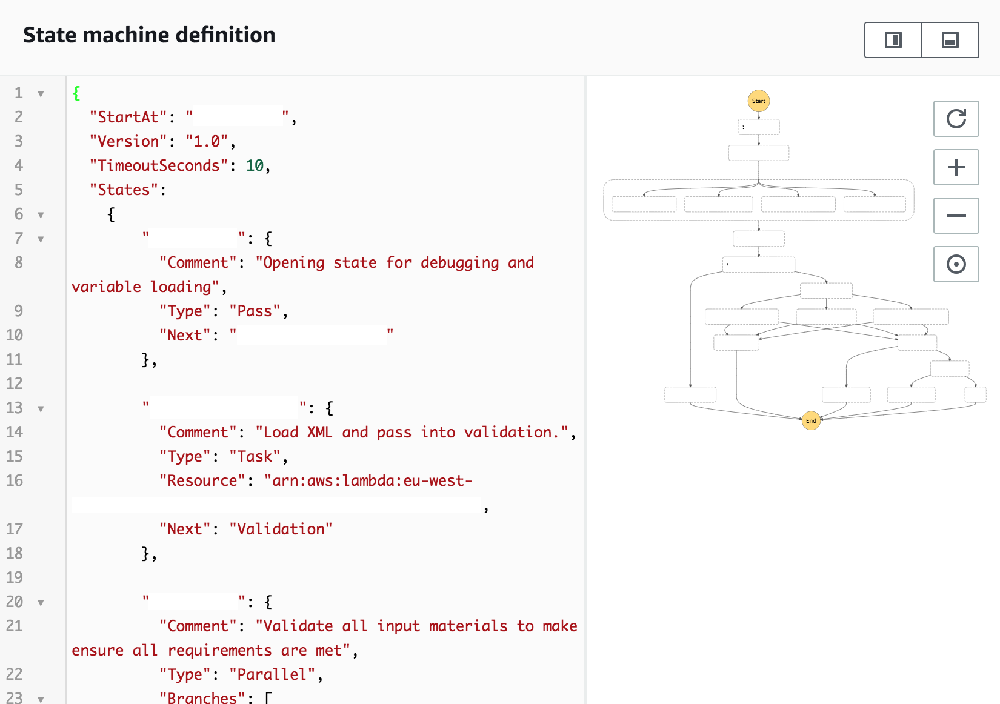
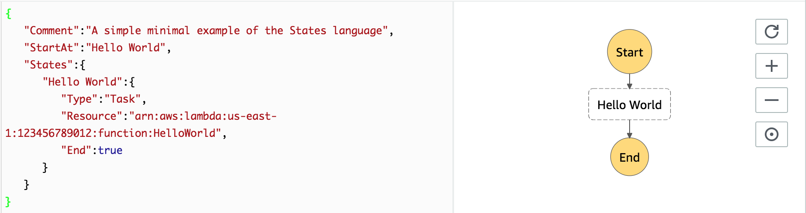
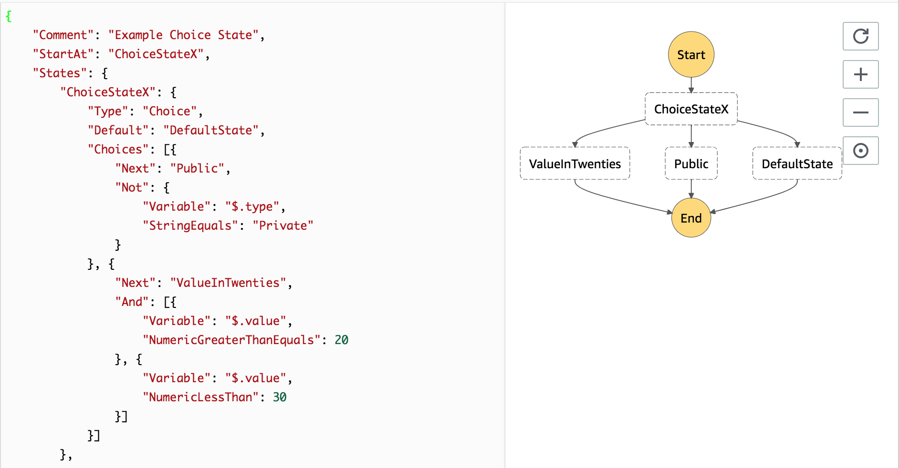

# stairstep

StairStep is a Pythonic API for designing [AWS Step Functions](https://aws.amazon.com/step-functions/) using [Amazon's State Language](https://states-language.net/spec.html)



Instead of hand crafting JSON, StairStep allows you define step functions using Python code which allows you to easily import information from outside sources and dynamically create step functions on the fly. 

# Development Progress / Coverage
| Lanuage Feature  |  Type | Progress  | 
|---|---|---|
| State  | Pass  | ✅  |
| State  | Task  | ✅  |
| State  | Succeed  | ✅  |
| State  | Fail  | ✅  |
| State  | Choice  | ✅  |
| Field  | Common Validations  |  ✅  |
| State  | Wait  | Next 🛣 |
| State  | Parallel  | Next 🛣 |


# Examples
* [Hello World](#helloworld)
* [Complex Choice State](#choicestate)

## <a name="helloworld"></a> Hello World 
Using the example from the [Amazon's State Language](https://states-language.net/spec.html#example) page

```
{
    "Comment": "A simple minimal example of the States language",
    "StartAt": "Hello World",
    "States": {
    "Hello World": { 
      "Type": "Task",
      "Resource": "arn:aws:lambda:us-east-1:123456789012:function:HelloWorld",
      "End": true
    }
  }
}
```

We can easily craft that in StairStep as follows

```
# Create a parent StairStep object
ss = StairStep(comment="A simple minimal example of the States language", startAt="Hello World")

# Create the HelloWorld step
StateTask(name="Hello World", resource="arn:aws:lambda:us-east-1:123456789012:function:HelloWorld", end=True)

# Add the step into the StairStep object
ss.addState(hello)

# Create the Amazon State Language Export
ss.json()

{  
   "Comment":"A simple minimal example of the States language",
   "StartAt":"Hello World",
   "States":{  
      "Hello World":{  
         "Type":"Task",
         "Resource":"arn:aws:lambda:us-east-1:123456789012:function:HelloWorld",
         "End":true
      }
   }
}
```


## <a name="choicestate"></a> Complex Choice State

```
ss = StairStep(
    comment = "Example Choice State",
    startAt = "ChoiceStateX"
)
# Create a ChoiceRule, which is composed of choice expression(s)
# This checks to see if the variable $.type is not "Private"
typeNotPrivate = ChoiceRule(operator="Not", snext="Public", conditions=
    ChoiceExpression(operator="StringEquals", variable="$.type", value="Private")
)

# This checks to see if the value of $.value is >=20 or <30
valueInTwenties = ChoiceRule(operator="And", snext="ValueInTwenties", conditions=
    [
        ChoiceExpression(operator="NumericGreaterThanEquals", variable="$.value", value=20),
        ChoiceExpression(operator="NumericLessThan", variable="$.value", value=30)
    ]
)
state = StateChoice(name="ChoiceStateX", choices=[typeNotPrivate,valueInTwenties],default="DefaultState")

default = StatePass(name="DefaultState", end=True)
in_twenties = StatePass(name="ValueInTwenties", end=True)
public = StatePass(name="Public", end=True)

ss.addState(state)
ss.addState(in_twenties)
ss.addState(public)
ss.addState(default)
ss.json()
```

```
{
	"Comment": "Example Choice State",
	"StartAt": "ChoiceStateX",
	"States": {
		"ChoiceStateX": {
			"Type": "Choice",
			"Default": "DefaultState",
			"Choices": [{
				"Next": "Public",
				"Not": {
					"Variable": "$.type",
					"StringEquals": "Private"
				}
			}, {
				"Next": "ValueInTwenties",
				"And": [{
					"Variable": "$.value",
					"NumericGreaterThanEquals": 20
				}, {
					"Variable": "$.value",
					"NumericLessThan": 30
				}]
			}]
		},
		"ValueInTwenties": {
			"Type": "Pass",
			"End": true
		},
		"Public": {
			"Type": "Pass",
			"End": true
		},
		"DefaultState": {
			"Type": "Pass",
			"End": true
		}
	}
}
```

